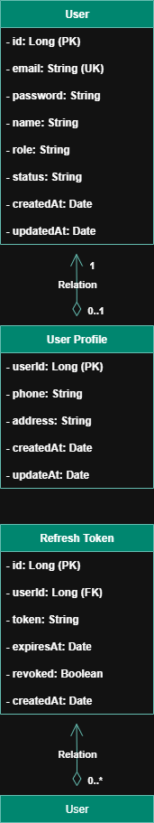
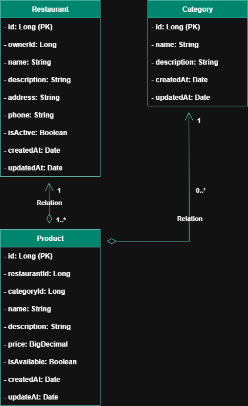
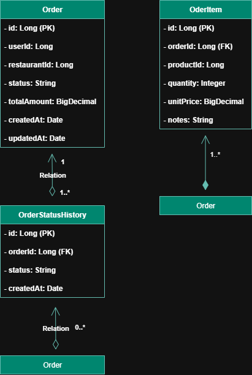

# QuickBite

⚙️ Implementação de uma plataforma web do zero, abordando todas as etapas de desenvolvimento, assim como tecnologias para contrução do projeto, desde a documentação/prototipagem até o build/deploy.

🍔 QuickBite - Backend Monorepo (Cloud Setup)
Este é o repositório principal (monorepo) que contém toda a arquitetura de microsserviços do backend para a plataforma QuickBite, um sistema de delivery de comida.

🏗️ Arquitetura
O sistema é construído com uma arquitetura de microsserviços, utilizando Spring Boot e Spring Cloud, conectando-se a serviços em nuvem.

## 🔄 Fluxo de Requisições

```bash
Cliente → API Gateway (8081) → Microsserviços (8082-8086)
```

## ☁️ Infraestrutura na Nuvem

| Serviço       | Fornecedor   | Uso                  |
|---------------|--------------|----------------------|
| 🐘 **PostgreSQL** | [Neon.tech](https://neon.tech/) | Banco de dados |
| ⚡ **Kafka**      | [Upstash.com](https://upstash.com/) | Mensageria assíncrona |
| 🗃️ **Redis**     | [Upstash.com](https://upstash.com/) | Cache e sessões      |

## 📦 Microsserviços

| Serviço | Descrição | Porta Padrão |
| :--- | :--- | :--- |
| 🚪 **`api-gateway`** | 	API Gateway com roteamento estático | `8081` |
| 🔐 **`auth-service`** | Autenticação e autorização JWT | `8082` |
| 🍕 **`product-service`** | Catálogo de produtos e cardápios | `8083` |
| 📋 **`order-service`** | Gestão do ciclo de vida de pedidos | `8084` |
| 💳 **`payment-service`** | Processamento de pagamentos | `8085` |
| 📧 **`notification-service`** | Notificações por e-mail e SMS | `8086` |


## 🚀 Como Executar (Desenvolvimento Local)
📋 Pré-requisitos
Java 17 ou superior

Maven 3.6 ou superior

Contas nos serviços:

🌐 Neon.tech (PostgreSQL)

⚡ Upstash.com (Kafka + Redis)

## ▶️ Execução dos Serviços
Execute os serviços:

```bash
# Terminal 1 - API Gateway
cd services/api-gateway
mvn spring-boot:run

# Terminal 2 - Autenticação
cd services/auth-service
mvn spring-boot:run

# Terminal 3 - Produtos
cd services/product-service
mvn spring-boot:run

# Terminal 4 - Pedidos
cd services/order-service
mvn spring-boot:run

# Terminal 5 - Pagamentos
cd services/payment-service
mvn spring-boot:run

# Terminal 6 - Notificações
cd services/notification-service
mvn spring-boot:run
```

## ✅ Verificação

Acesse: http://localhost:8082/api/auth/test

## 🔐 Auth Service Database (`quickbite-auth-db`)




### 🔗 Relacionamentos principais
- **users** ⮕ **user_profiles** → Relação 1:1 (cada usuário tem um perfil)  
- **users** ⮕ **refresh_tokens** → Relação 1:N (um usuário pode ter múltiplos tokens ativos)  

---

## 🍕 Product Service Database (`quickbite-product-db`)




### 🔗 Relacionamentos principais
- **restaurants** ⮕ **products** → Relação 1:N (um restaurante oferece vários produtos)  
- **categories** ⮕ **products** → Relação 1:N (uma categoria pode agrupar vários produtos)  

---

## 📋 Order Service Database (`quickbite-order-db`)



### 🔗 Relacionamentos principais
- **orders** ⮕ **order_items** → Relação 1:N (um pedido contém vários itens)  
- **orders** ⮕ **order_status_history** → Relação 1:N (um pedido possui histórico de mudanças de status)  


